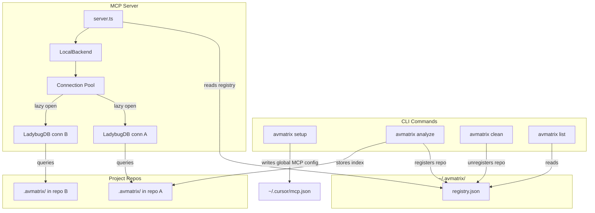
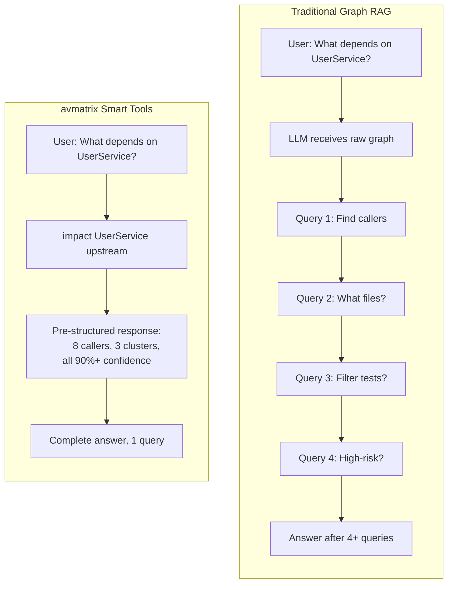

# avmatrix
**⚠ Important Notice:** avmatrix has NO official cryptocurrency, token, or coin. Any token/coin using the avmatrix name on Pump.fun or any other platform is **not affiliated with, endorsed by, or created by** this project or its maintainers. Do not purchase any cryptocurrency claiming association with avmatrix.

**Building nervous system for agent context.**

Indexes any codebase into a knowledge graph — every dependency, call chain, cluster, and execution flow — then exposes it through smart tools so AI agents never miss code.

> *Like DeepWiki, but deeper.* DeepWiki helps you *understand* code. avmatrix lets you *analyze* it — because a knowledge graph tracks every relationship, not just descriptions.

**TL;DR:** The **CLI + MCP** path is the core product: index locally, expose the graph to your editor or agent, and work against the same repo-backed knowledge graph every time. The **Web UI** is the local browser frontend for that same runtime via `avmatrix serve` when you want graph browsing, repo switching, and chat in a browser.

---

## Two Ways to Use avmatrix

|                   | **CLI + MCP**                                                  | **Web UI**                                                                  |
| ----------------- | -------------------------------------------------------------- | --------------------------------------------------------------------------- |
| **What**          | Local indexer, MCP server, direct graph tools                  | Local browser frontend for `avmatrix serve`                                 |
| **For**           | Daily development with Claude Code, Codex, Cursor, OpenCode    | Graph browsing, repo switching, local chat/session UX                       |
| **Scale**         | Full repos, any size                                           | Uses backend indexes, so practical limits are the local backend machine     |
| **Install**       | Build from source, then `npm link` in `avmatrix/`             | Run `avmatrix serve` plus `avmatrix-web`, or use the Docker stack           |
| **Storage**       | LadybugDB native in repo-local `.avmatrix/`                    | Uses backend data from the same repo-local `.avmatrix/`                     |
| **Parsing**       | Tree-sitter native bindings                                    | Reads backend graph over HTTP                                               |
| **Privacy**       | Local-first                                                    | Local-first                                                                 |

> **Bridge mode:** `avmatrix serve` is the bridge. The web UI auto-detects `http://localhost:4747`, lists indexed repos, can start local analyze jobs, and uses the same runtime core as MCP.

---

## Development

- [ARCHITECTURE.md](ARCHITECTURE.md) — packages, index → graph → MCP flow, where to change code
- [RUNBOOK.md](RUNBOOK.md) — analyze, embeddings, stale index, MCP recovery, CI snippets
- [GUARDRAILS.md](GUARDRAILS.md) — safety rules and operational “Signs” for contributors and agents
- [CONTRIBUTING.md](CONTRIBUTING.md) — license, setup, commits, and pull requests
- [TESTING.md](TESTING.md) — test commands for `avmatrix` and `avmatrix-web`

## CLI + MCP (recommended)

The CLI indexes your repository and runs an MCP server that gives AI agents deep codebase awareness.

### Quick Start

```bash
# 1. Build and link the local CLI once
git clone https://github.com/tamnguyendinh/AVmatrix.git
cd AVmatrix/avmatrix-shared && npm install && npm run build
cd ../avmatrix && npm install && npm link

# 2. Index your target repo
cd /path/to/your/repo
avmatrix analyze

# 3. Optional one-time editor setup
avmatrix setup
```

`analyze` is the repo-local step. It builds the graph, stores the index in `.avmatrix/`, writes the managed AVmatrix sections in `AGENTS.md` / `CLAUDE.md`, and installs repo-local skills under `.claude/skills/avmatrix/`.

`setup` is the global editor step. It writes MCP config for supported editors, installs global skills where supported, and registers Claude Code hooks.

The manual MCP snippets below assume the local `avmatrix` CLI is already on your `PATH`. In the current source tree, the canonical way to do that is `npm link` from `AVmatrix/avmatrix` after building `avmatrix-shared`.

### MCP local Setup

`avmatrix setup` auto-detects your editors and writes the correct global MCP config. You only need to run it once.

### Editor Support

| Editor           | MCP | Skills | Hooks | Setup Path |
| ---------------- | --- | ------ | ----- | ---------- |
| **Claude Code**  | Yes | Yes    | Yes   | `avmatrix setup` or manual |
| **Codex**        | Yes | Yes    | —     | `avmatrix setup` or manual |
| **Cursor**       | Yes | Yes    | —     | `avmatrix setup` or manual |
| **OpenCode**     | Yes | Yes    | —     | `avmatrix setup` or manual |
| **Other MCP clients** | Manual | Manual | — | Configure a local stdio MCP entry if the client supports it |

> **Claude Code** currently has the deepest integration: MCP + global skills + PreToolUse/PostToolUse hooks.

If you prefer manual configuration:

**Claude Code** (`~/.claude.json` or via `claude mcp add`):

```bash
# First install the local CLI onto PATH (for example: `cd avmatrix && npm link`)
claude mcp add avmatrix -- avmatrix mcp
```

**Codex** (full support — MCP + skills):

```bash
# First install the local CLI onto PATH (for example: `cd avmatrix && npm link`)
codex mcp add avmatrix -- avmatrix mcp
```

**Cursor** (`~/.cursor/mcp.json` — global, works for all projects):

```json
{
  "mcpServers": {
    "avmatrix": {
      "command": "avmatrix",
      "args": ["mcp"]
    }
  }
}
```

**OpenCode** (`~/.config/opencode/opencode.json`):

```json
{
  "mcp": {
    "avmatrix": {
      "type": "local",
      "command": ["avmatrix", "mcp"]
    }
  }
}
```

**Codex** (`~/.codex/config.toml` for system scope, or `.codex/config.toml` for project scope):

```toml
[mcp_servers.avmatrix]
command = "avmatrix"
args = ["mcp"]
```

### CLI Commands

```bash
avmatrix setup                   # Configure MCP for your editors (one-time)
avmatrix analyze [path]          # Index a repository (or update stale index)
avmatrix analyze --force         # Force full re-index
avmatrix analyze --skills        # Generate repo-specific skill files from detected communities
avmatrix analyze --embeddings    # Enable embedding generation (slower, better search)
avmatrix analyze --skip-agents-md  # Skip updating the managed AVmatrix section in AGENTS.md/CLAUDE.md
avmatrix analyze --skip-git      # Index a folder without requiring .git
avmatrix analyze --name <alias>  # Register a repo under a custom registry name
avmatrix analyze --verbose       # Log skipped files when parsers are unavailable
avmatrix index [path...]         # Register an existing local index into the global registry
avmatrix mcp                     # Start MCP server (stdio) — serves all indexed repos
avmatrix serve                   # Start local HTTP server for the web UI and local session runtime
avmatrix list                    # List all indexed repositories
avmatrix status                  # Show index status for current repo
avmatrix clean                   # Delete index for current repo
avmatrix clean --all --force     # Delete all indexes
avmatrix wiki                    # Show wiki capability status in the local-only build
avmatrix wiki-mode [mode]        # Show or set wiki mode (off|local)

# Direct graph tools (CLI, no MCP transport)
avmatrix query <search_query>    # Search execution flows related to a concept
avmatrix context [name]          # 360-degree symbol context
avmatrix impact [target]         # Blast radius analysis for a symbol
avmatrix cypher <query>          # Raw Cypher query against the graph
avmatrix detect-changes          # Analyze current git diff against the graph

# Repository groups (multi-repo / monorepo service tracking)
avmatrix group create <name>     # Create a repository group
avmatrix group add <group> <groupPath> <registryName>
avmatrix group remove <group> <path>
avmatrix group list [name]       # List groups, or show one group's config
avmatrix group sync <name>       # Extract contracts and match across repos/services
avmatrix group contracts <name>  # Inspect extracted contracts and cross-links
avmatrix group query <name> <query>  # Search execution flows across all repos in a group
avmatrix group status <name>     # Check staleness of repos in a group
```

Repository-local indexing settings live in `.avmatrix/settings.json`. Today that includes `maxExecutionFlows`, which controls the cap used when materializing execution flows during `analyze`. `AVMATRIX_MAX_PROCESSES` is still supported as a temporary override.

### What Your AI Agent Gets

**16 tools** exposed via MCP (11 repo/global + 5 group):

| Tool | What It Does | `repo` Param |
| ---- | ------------ | ------------ |
| `list_repos` | Discover all indexed repositories | — |
| `query` | Process-grouped hybrid search (BM25 + semantic + RRF) | Optional |
| `cypher` | Raw Cypher graph queries | Optional |
| `context` | 360-degree symbol view with categorized refs and process participation | Optional |
| `detect_changes` | Git-diff impact mapped back to symbols and processes | Optional |
| `rename` | Multi-file coordinated rename with graph + text search | Optional |
| `impact` | Blast radius analysis with depth grouping and confidence | Optional |
| `route_map` | Route-to-handler-to-consumer mapping for API paths | Optional |
| `tool_map` | MCP/RPC tool definitions and handler mapping | Optional |
| `shape_check` | Consumer-vs-response shape checks for API routes | Optional |
| `api_impact` | Pre-change impact report for an API route handler | Optional |
| `group_list` | List configured repository groups | — |
| `group_sync` | Rebuild contract registry and cross-links for a group | — |
| `group_contracts` | Inspect extracted contracts and cross-links | — |
| `group_query` | Search execution flows across all repos in a group | — |
| `group_status` | Check staleness of repos in a group | — |

> When only one repo is indexed, the `repo` parameter is optional. With multiple repos, specify which one: `query({query: "auth", repo: "my-app"})`.

**Resources** for instant context:

| Resource                                  | Purpose                                              |
| ----------------------------------------- | ---------------------------------------------------- |
| `avmatrix://repos`                      | List all indexed repositories (read this first)      |
| `avmatrix://setup`                      | Generated setup/onboarding content for indexed repos |
| `avmatrix://repo/{name}/context`        | Codebase stats, staleness check, and available tools |
| `avmatrix://repo/{name}/clusters`       | All functional clusters with cohesion scores         |
| `avmatrix://repo/{name}/cluster/{name}` | Cluster members and details                          |
| `avmatrix://repo/{name}/processes`      | All execution flows                                  |
| `avmatrix://repo/{name}/process/{name}` | Full process trace with steps                        |
| `avmatrix://repo/{name}/schema`         | Graph schema for Cypher queries                      |

**2 MCP prompts** for guided workflows:

| Prompt            | What It Does                                                              |
| ----------------- | ------------------------------------------------------------------------- |
| `detect_impact` | Pre-commit change analysis — scope, affected processes, risk level       |
| `generate_map`  | Architecture documentation from the knowledge graph with mermaid diagrams |

**6 core skills** installed repo-locally under `.claude/skills/avmatrix/` during `analyze`:

- **Exploring** — Navigate unfamiliar code using the knowledge graph
- **Debugging** — Trace bugs through call chains
- **Impact Analysis** — Analyze blast radius before changes
- **Refactoring** — Plan safe refactors using dependency mapping
- **Guide** — Tool/resource/schema reference for AVmatrix itself
- **CLI** — Index, status, clean, serve, wiki capability commands

**Repo-specific skills** generated with `--skills`:

When you run `avmatrix analyze --skills`, avmatrix detects the functional areas of your codebase (via Leiden community detection) and generates a `SKILL.md` file for each one under `.claude/skills/generated/`. Each skill describes a module's key files, entry points, execution flows, and cross-area connections — so your AI agent gets targeted context for the exact area of code you're working in. Skills are regenerated on each `--skills` run to stay current with the codebase.

---

## Multi-Repo MCP Architecture

avmatrix uses a **global registry** so one MCP server can serve multiple indexed repos. No per-project MCP config needed — set it up once and it works everywhere.



**How it works:** Each `avmatrix analyze` stores the index in `.avmatrix/` inside the repo (portable, gitignored) and registers a pointer in `~/.avmatrix/registry.json`. When an AI agent starts, the MCP server reads the registry and can serve any indexed repo. LadybugDB connections are opened lazily on first query and evicted after 5 minutes of inactivity (max 5 concurrent). If only one repo is indexed, the `repo` parameter is optional on all tools — agents don't need to change anything.

Per-repo indexing settings live alongside the index in `.avmatrix/settings.json`. The current repo-local setting is `maxExecutionFlows`, which acts as the cap for materialized execution flows during analysis.

---

## Web UI (local frontend + local backend)

A local browser frontend for the same runtime core used by the CLI and MCP server. The active flow is:

1. start `avmatrix serve`
2. open the web UI
3. let it auto-detect `http://localhost:4747`
4. pick an indexed repo or start a local analyze job
5. browse the graph and use the local chat/session runtime


Or run locally:

```bash
git clone https://github.com/tamnguyendinh/AVmatrix.git
cd AVmatrix/avmatrix-shared && npm install && npm run build
cd ../avmatrix && npm install
cd ../avmatrix-web && npm install

# terminal 1
cd ../avmatrix
npm run serve

# terminal 2
cd ../avmatrix-web
npm run dev
```

## Docker

The repo ships a two-container Docker stack in `docker-compose.yaml` plus matching image-build workflows. The current compose defaults and `.env.example` use these image names:

| Image                                              | Purpose                                                                |
| -------------------------------------------------- | ---------------------------------------------------------------------- |
| `ghcr.io/abhigyanpatwari/avmatrix:latest`     | CLI / `avmatrix serve` backend (HTTP API on port `4747`, MCP, indexer) |
| `ghcr.io/abhigyanpatwari/avmatrix-web:latest` | Static web UI (port `4173`) |

> **Current codebase note:** the local CLI keeps `serve` loopback-only by default, while `Dockerfile.cli` runs `serve --host 0.0.0.0` for container exposure. Treat Docker as a distinct deployment path from the local CLI flow and verify it in your environment.

### One-command setup

```bash
docker compose up -d
```

This starts the server on `http://localhost:4747` and the web UI on
`http://localhost:4173`. The UI auto-detects the server because the browser
runs on the host and reaches the container via the mapped port.

A named volume (`avmatrix-data`) persists the global registry, indexes, and
cloned repos at `/data/avmatrix` inside the server container. To make repos on
your host machine indexable, set `WORKSPACE_DIR` before bringing the stack up:

```bash
WORKSPACE_DIR=$HOME/code docker compose up -d
# Inside the server container the directory is mounted read-only at /workspace.
docker compose exec avmatrix-server avmatrix index /workspace/my-repo
```

### Direct `docker run`

```bash
# Server
docker run --rm -d \
  --name avmatrix-server \
  -p 4747:4747 \
  -v avmatrix-data:/data/avmatrix \
  ghcr.io/abhigyanpatwari/avmatrix:latest

# Web UI
docker run --rm -d \
  --name avmatrix-web \
  -p 4173:4173 \
  ghcr.io/abhigyanpatwari/avmatrix-web:latest
```

Optional env file (override image tags, container names, ports, workspace dir):

```bash
cp .env.example .env
docker compose --env-file .env up -d
```

### Versioning & supply-chain protection

The Docker images are version-locked to the npm package:

- Stable images are **only published from `vX.Y.Z` git tags** (via `docker.yml`
  triggered directly by the tag push), and the workflow refuses to build unless
  the tag exactly matches `avmatrix/package.json`'s version. So
  `ghcr.io/abhigyanpatwari/avmatrix:1.6.2` is byte-for-byte the same release
  as `npm install avmatrix@1.6.2` — no drift, no floating builds from `main`.
- Release-candidate images (e.g. `:1.7.0-rc.1`) are published alongside each
  RC npm release. They are built by `release-candidate.yml` calling `docker.yml`
  as a reusable workflow after the RC tag is created and pushed.
- `:latest` is auto-promoted only from non-prerelease tags by the Docker
  metadata action, so it always points at a real, npm-published version.

Both images are signed with [Cosign keyless signing][cosign-keyless] using the
workflow's GitHub OIDC identity, and shipped with build provenance and SBOM
attestations. **This is your protection against supply-chain attacks**: even if
an attacker republishes a same-named image elsewhere (or somehow pushes to a
typo-squatted registry), they cannot forge a Cosign signature tied to
`abhigyanpatwari/avmatrix`'s `docker.yml`. Always verify before pulling into
sensitive environments:

**Stable releases** — signed from the `v*` tag ref:

```bash
cosign verify ghcr.io/abhigyanpatwari/avmatrix:1.6.2 \
  --certificate-identity-regexp '^https://github\.com/abhigyanpatwari/avmatrix/\.github/workflows/docker\.yml@refs/tags/v[0-9]+\.[0-9]+\.[0-9]+(-[a-zA-Z0-9.]+)?$' \
  --certificate-oidc-issuer https://token.actions.githubusercontent.com
```

The regex pins the certificate identity to this repo's `docker.yml` workflow
**run from a `v*` tag** — rejecting unsigned images, images signed by other
workflows, and images signed from unprotected refs.

**Release candidates** — signed from `refs/heads/main` (the caller's ref when
`release-candidate.yml` invokes `docker.yml` as a reusable workflow):

```bash
cosign verify ghcr.io/abhigyanpatwari/avmatrix:1.7.0-rc.1 \
  --certificate-identity 'https://github.com/abhigyanpatwari/avmatrix/.github/workflows/docker.yml@refs/heads/main' \
  --certificate-oidc-issuer https://token.actions.githubusercontent.com
```

You can also inspect the build provenance and SBOM:

```bash
cosign download attestation ghcr.io/abhigyanpatwari/avmatrix:1.6.2 \
  --predicate-type https://slsa.dev/provenance/v1
```

#### Kubernetes: enforce signatures at admission

For Kubernetes deployments, ship the bundled
[`ClusterImagePolicy`](deploy/kubernetes/cluster-image-policy.yaml) so the
[Sigstore policy-controller][policy-controller] rejects any avmatrix pod whose
image is not signed by this repo's `docker.yml` running from a `vX.Y.Z` tag —
the same identity the `cosign verify` snippet above pins.

```bash
# 1. Install the controller (one-time, cluster-wide)
helm repo add sigstore https://sigstore.github.io/helm-charts && helm repo update
helm install policy-controller -n cosign-system --create-namespace \
  sigstore/policy-controller

# 2. Opt your namespace in
kubectl label namespace <your-ns> policy.sigstore.dev/include=true

# 3. Apply the policy
kubectl apply -f deploy/kubernetes/cluster-image-policy.yaml
```

After this, attempting to deploy an unsigned image — or one signed by anything
other than `abhigyanpatwari/avmatrix`'s `docker.yml` at a `v*` tag — fails the
admission webhook before a pod is ever created. This turns the verifiable
signature into an enforced policy, which is the supply-chain control most
clusters actually need.

[cosign-keyless]: https://docs.sigstore.dev/cosign/signing/overview/
[policy-controller]: https://docs.sigstore.dev/policy-controller/overview/

### Files

- [Dockerfile.web](Dockerfile.web) — builds `avmatrix-shared` and `avmatrix-web`, then serves the production frontend.
- [Dockerfile.cli](Dockerfile.cli) — builds the CLI/server image and starts `avmatrix serve --host 0.0.0.0 --port 4747`.
- [docker-compose.yaml](docker-compose.yaml) — starts both signed images side by side.
- [.env.example](.env.example) — overrides for image names, container names, ports, and the workspace mount.

In the active local-runtime path, the web UI is a frontend over the backend HTTP API. The browser auto-detects the local backend, shows indexed repos, and routes graph operations and session chat through `avmatrix serve`.

---

## The Problem avmatrix Solves

Tools like **Cursor**, **Claude Code**, **Codex**, **Cline**, **Roo Code**, and **Windsurf** are powerful — but they don't truly know your codebase structure.

**What happens:**

1. AI edits `UserService.validate()`
2. Doesn't know 47 functions depend on its return type
3. **Breaking changes ship**

### Traditional Graph RAG vs avmatrix

Traditional approaches give the LLM raw graph edges and hope it explores enough. avmatrix **precomputes structure at index time** — clustering, tracing, scoring — so tools return complete context in one call:



**Core innovation: Precomputed Relational Intelligence**

- **Reliability** — LLM can't miss context, it's already in the tool response
- **Token efficiency** — No 10-query chains to understand one function
- **Model democratization** — Smaller LLMs work because tools do the heavy lifting

---

## How It Works

avmatrix builds a complete knowledge graph of your codebase through a multi-phase indexing pipeline:

1. **Structure** — Walks the file tree and maps folder/file relationships
2. **Parsing** — Extracts functions, classes, methods, and interfaces using Tree-sitter ASTs
3. **Resolution** — Resolves imports, function calls, heritage, constructor inference, and `self`/`this` receiver types across files with language-aware logic
4. **Clustering** — Groups related symbols into functional communities
5. **Processes** — Traces execution flows from entry points through call chains
6. **Search** — Builds hybrid search indexes for fast retrieval

### Supported Languages

| Language | Imports | Named Bindings | Exports | Heritage | Type Annotations | Constructor Inference | Config | Frameworks | Entry Points |
|----------|---------|----------------|---------|----------|-----------------|---------------------|--------|------------|-------------|
| TypeScript | ✓ | ✓ | ✓ | ✓ | ✓ | ✓ | ✓ | ✓ | ✓ |
| JavaScript | ✓ | ✓ | ✓ | ✓ | — | ✓ | ✓ | ✓ | ✓ |
| Python | ✓ | ✓ | ✓ | ✓ | ✓ | ✓ | ✓ | ✓ | ✓ |
| Java | ✓ | ✓ | ✓ | ✓ | ✓ | ✓ | — | ✓ | ✓ |
| Kotlin | ✓ | ✓ | ✓ | ✓ | ✓ | ✓ | — | ✓ | ✓ |
| C# | ✓ | ✓ | ✓ | ✓ | ✓ | ✓ | ✓ | ✓ | ✓ |
| Go | ✓ | — | ✓ | ✓ | ✓ | ✓ | ✓ | ✓ | ✓ |
| Rust | ✓ | ✓ | ✓ | ✓ | ✓ | ✓ | — | ✓ | ✓ |
| PHP | ✓ | ✓ | ✓ | — | ✓ | ✓ | ✓ | ✓ | ✓ |
| Ruby | ✓ | — | ✓ | ✓ | — | ✓ | — | ✓ | ✓ |
| Swift | — | — | ✓ | ✓ | ✓ | ✓ | ✓ | ✓ | ✓ |
| C | — | — | ✓ | — | ✓ | ✓ | — | ✓ | ✓ |
| C++ | — | — | ✓ | ✓ | ✓ | ✓ | — | ✓ | ✓ |
| Dart | ✓ | — | ✓ | ✓ | ✓ | ✓ | — | ✓ | ✓ |

**Imports** — cross-file import resolution · **Named Bindings** — `import { X as Y }` / re-export tracking · **Exports** — public/exported symbol detection · **Heritage** — class inheritance, interfaces, mixins · **Type Annotations** — explicit type extraction for receiver resolution · **Constructor Inference** — infer receiver type from constructor calls (`self`/`this` resolution included for all languages) · **Config** — language toolchain config parsing (tsconfig, go.mod, etc.) · **Frameworks** — AST-based framework pattern detection · **Entry Points** — entry point scoring heuristics

---

## Tool Examples

### Impact Analysis

```
impact({target: "UserService", direction: "upstream", minConfidence: 0.8})

TARGET: Class UserService (src/services/user.ts)

UPSTREAM (what depends on this):
  Depth 1 (WILL BREAK):
    handleLogin [CALLS 90%] -> src/api/auth.ts:45
    handleRegister [CALLS 90%] -> src/api/auth.ts:78
    UserController [CALLS 85%] -> src/controllers/user.ts:12
  Depth 2 (LIKELY AFFECTED):
    authRouter [IMPORTS] -> src/routes/auth.ts
```

Options: `maxDepth`, `minConfidence`, `relationTypes` (`CALLS`, `IMPORTS`, `EXTENDS`, `IMPLEMENTS`), `includeTests`

### Process-Grouped Search

```
query({query: "authentication middleware"})

processes:
  - summary: "LoginFlow"
    priority: 0.042
    symbol_count: 4
    process_type: cross_community
    step_count: 7

process_symbols:
  - name: validateUser
    type: Function
    filePath: src/auth/validate.ts
    process_id: proc_login
    step_index: 2

definitions:
  - name: AuthConfig
    type: Interface
    filePath: src/types/auth.ts
```

### Context (360-degree Symbol View)

```
context({name: "validateUser"})

symbol:
  uid: "Function:validateUser"
  kind: Function
  filePath: src/auth/validate.ts
  startLine: 15

incoming:
  calls: [handleLogin, handleRegister, UserController]
  imports: [authRouter]

outgoing:
  calls: [checkPassword, createSession]

processes:
  - name: LoginFlow (step 2/7)
  - name: RegistrationFlow (step 3/5)
```

### Detect Changes (Pre-Commit)

```
detect_changes({scope: "all"})

summary:
  changed_count: 12
  affected_count: 3
  changed_files: 4
  risk_level: medium

changed_symbols: [validateUser, AuthService, ...]
affected_processes: [LoginFlow, RegistrationFlow, ...]
```

### Rename (Multi-File)

```
rename({symbol_name: "validateUser", new_name: "verifyUser", dry_run: true})

status: success
files_affected: 5
total_edits: 8
graph_edits: 6     (high confidence)
text_search_edits: 2  (review carefully)
changes: [...]
```

### Cypher Queries

```cypher
-- Find what calls auth functions with high confidence
MATCH (c:Community {heuristicLabel: 'Authentication'})<-[:CodeRelation {type: 'MEMBER_OF'}]-(fn)
MATCH (caller)-[r:CodeRelation {type: 'CALLS'}]->(fn)
WHERE r.confidence > 0.8
RETURN caller.name, fn.name, r.confidence
ORDER BY r.confidence DESC
```

---

## Wiki Capability

In the current local-only build, `avmatrix wiki` is a gated capability check, not a full documentation generator.

```bash
avmatrix wiki
avmatrix wiki-mode
avmatrix wiki-mode off
avmatrix wiki-mode local
```

Current behavior:

- `avmatrix wiki` reports whether wiki capability is available in this build
- `avmatrix wiki-mode local` reserves the local wiki mode flag for a future local engine
- there is **no remote fallback** in the active local-only runtime path

---

## Tech Stack

- **`avmatrix/`** — Node.js CLI, indexing pipeline, MCP server, HTTP API, LadybugDB integration, local session runtime
- **`avmatrix-web/`** — React 18 + Vite frontend, Sigma.js graph visualization, backend HTTP client, local chat/session UI
- **`avmatrix-shared/`** — shared types and constants used by the CLI/server and the web app
- **Core parsing/indexing** — Tree-sitter native parsers, graph construction, clustering, process detection, hybrid search
- **Primary runtime path** — local backend on `http://localhost:4747`, with the browser acting as a frontend over that backend
- **Chat runtime path** — local session bridge in `avmatrix serve`, backed by the Codex session adapter in the current codebase

---

## Planning

Current implementation and design work is tracked in [`docs/plans/`](docs/plans/).

Themes visible in the current codebase:

- local-first web chat/runtime UX over `avmatrix serve`
- MCP reliability, startup, and tool-contract hardening
- route / tool / API impact analysis
- execution-flow indexing and repo-local settings in `.avmatrix/settings.json`

---

## Security & Privacy

- **CLI / MCP / HTTP API**: local-first. Index data is stored in repo-local `.avmatrix/`. Global registry and runtime config live under `~/.avmatrix/`.
- **Web UI**: the active path is a local browser frontend connected to `http://localhost:4747`; repository data stays on your machine.
- **Chat runtime**: the current local session path is served by the backend runtime controller and Codex session adapter, not a hosted chat service.
- **Browser storage**: the web app stores lightweight local UI/runtime preferences in browser storage. The indexed graph and repo files stay in the local backend/runtime path.
- Open source — audit the code yourself.

---

## Acknowledgments

- [Tree-sitter](https://tree-sitter.github.io/) — AST parsing
- [LadybugDB](https://ladybugdb.com/) — Embedded graph database with vector support (formerly KuzuDB)
- [Sigma.js](https://www.sigmajs.org/) — WebGL graph rendering
- [transformers.js](https://huggingface.co/docs/transformers.js) — Browser ML
- [Graphology](https://graphology.github.io/) — Graph data structures
- [MCP](https://modelcontextprotocol.io/) — Model Context Protocol
